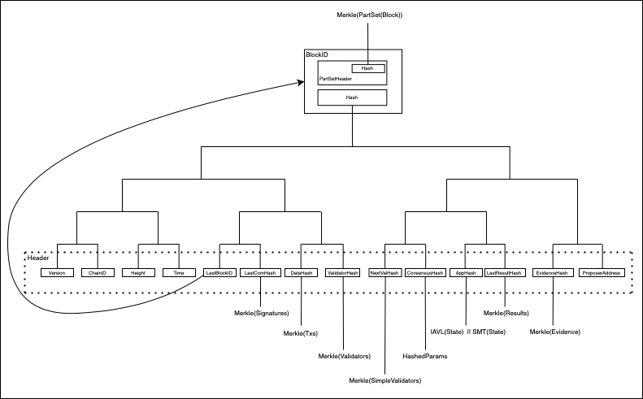

# go-codec-dagcosmos
A Go implementation of the DAG interface for [Cosmos IPLD types](https://github.com/ipld/ipld/tree/master/specs/codecs/dag-cosmos) for use with for [go-ipld-prime](https://github.com/ipld/go-ipld-prime/)

Use `Decode(ipld.NodeAssembler, io.Reader)` and `Encode(ipld.Node, io.Writer)` directly, or import the packages to have the codecs registered into the go-ipld-prime CID link loader.

Use the `dagcosmos.Type` slab to select the appropriate type (e.g. `dagcosmos.Type.Header`) for strictness guarantees.
Basic `ipld.Node`s will need to have the appropriate fields (and no others) to successfully encode using this codec.

## Supported types
[Commit](./commit) - Multicodec type TBD  
[Commit Tree](./commit_tree) - Multicodec type TBD  
[Evidence](./evidence) - Multicodec type TBD  
[Evidence Tree](./evidence_tree) - Multicodec type TBD  
[Header](./header) - Multicodec type TBD  
[Header Tree](./header_tree) (Header Field  Tree) - Multicodec type TBD  
[IAVL](./iavl) - Multicodec type TBD  
[Light Block](./light_block) - Multicodec type TBD  
[Params](./params) - Multicodec type TBD  
[Part Tree](./part_tree) - Multicodec type TBD  
[Proposal](./proposal) - Multicodec type TBD  
[Result](./result) - Multicodec type TBD  
[Result Tree](./result_tree) - Multicodec type TBD  
[Simple Validator](./simple_validator) - Multicodec type TBD  
[SMT](./smt) - Multicodec type TBD  
[Tx Tree](./tx_tree) - Multicodec type TBD  
[Validator Tree](./validator_tree) - Multicodec type TBD  

## Tendermint and Cosmos Merkle DAG Diagram

## License & Copyright

Copyright &copy; 2021 Vulcanize Inc

Licensed under either of

* Apache 2.0, ([LICENSE-APACHE](LICENSE-APACHE) / http://www.apache.org/licenses/LICENSE-2.0)
* MIT ([LICENSE-MIT](LICENSE-MIT) / http://opensource.org/licenses/MIT)

## Contribution

Unless you explicitly state otherwise, any contribution intentionally submitted for inclusion in the work by you, as defined in the Apache-2.0 license, shall be dual licensed as above, without any additional terms or conditions.
